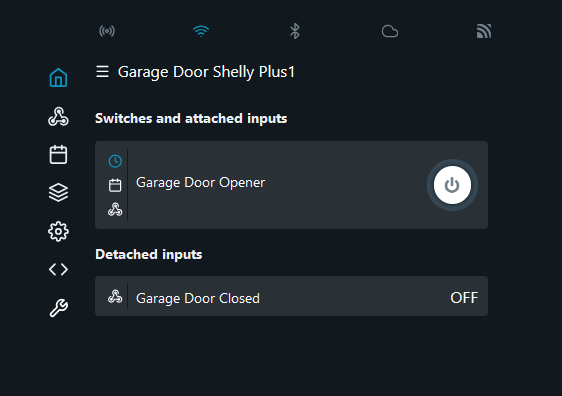
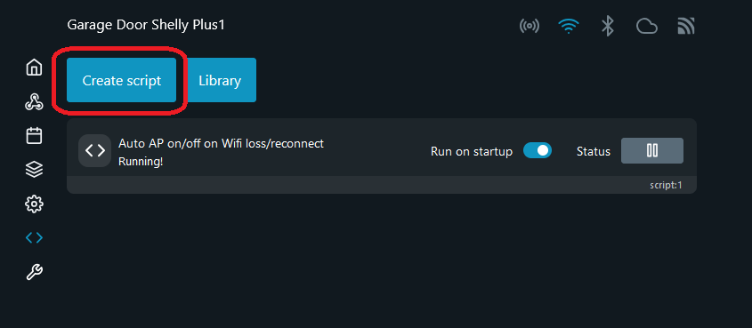
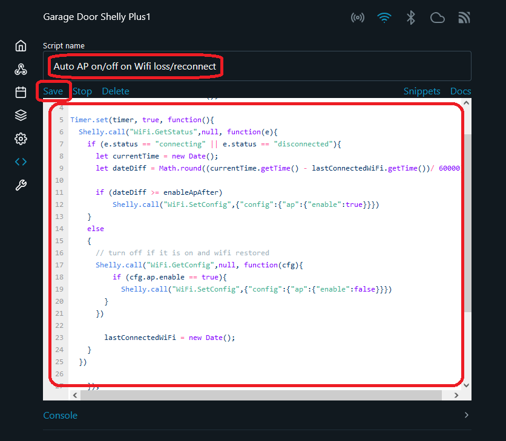
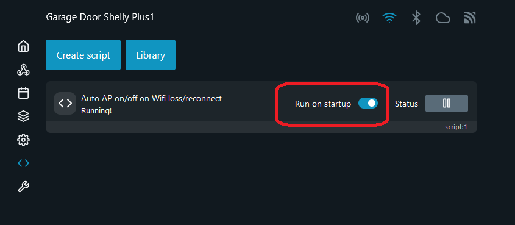
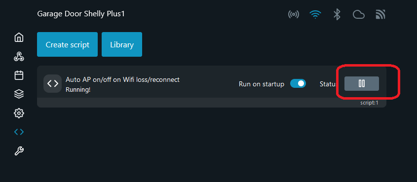

# shelly_auto_access_point

_Script to be run on Shelly smart releys which automatically turn access point on the device on/off on Wifi network loss or reconnect_

This script can be used for handy control and maintenance of Shelly devices in case if they were configured with their APs disabled. and, by some reason, their home Wifi network(s) became unavailable.

Script periodically checks Wifi status and, if Wifi network(s) lost, after a timeout it will start Access Point.
By default it will test Wifi status every 5 minutes and start AP if Wifi connection has not been recovered in 10-15 minutes.
If Wifi connection recovered, script will shut down AP after on the next check.

You may want to configure **password protected** AP before run this script. 

Script has been tested on Shelly Plus 1, Shelly Plus 1PM and Shelly 1 Mini Gen 3

# How to:

1. Log into your Shelly WebUI

2. Go to Script section

3. Press "Create script"

4. Copy and paste script into editor window, give your script a name and press "Save" button

5. Get back to Script section

6. Click "Run on startup" switch

7. Click "Run" button

